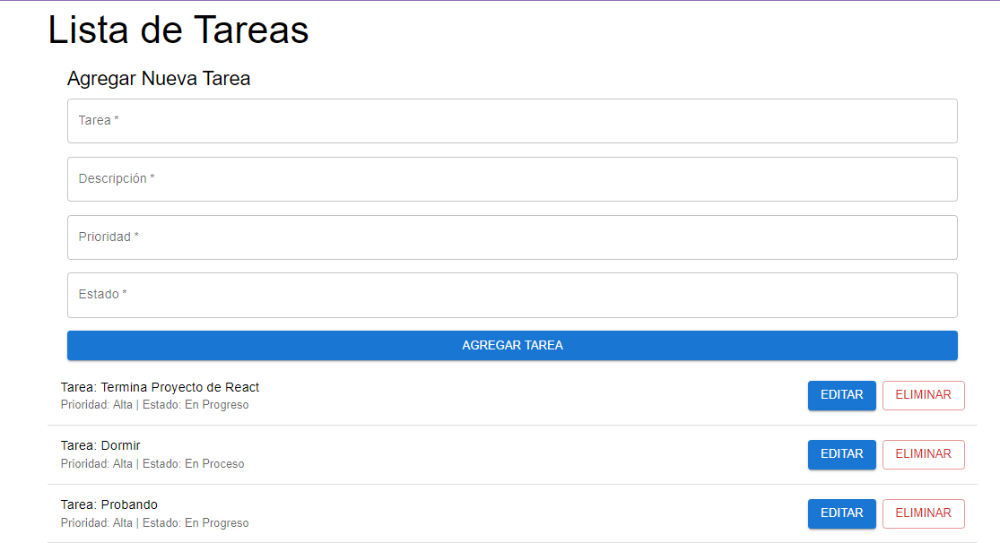

# 📝 Proyecto Final - Todo en Orden (Frontend)

## 🚀 Descripción
El frontend de "Todo en Orden" es la interfaz de usuario del proyecto. Permite a los usuarios interactuar con el sistema de tareas, creando, leyendo, actualizando y eliminando tareas en tiempo real. Está diseñado para ser intuitivo y responsivo.

## 🛠 Tecnologías Utilizadas
- **React.js**: Biblioteca para construir la interfaz de usuario.
- **Axios**: Cliente HTTP para manejar peticiones al backend.
- **Chakra UI**: Librería de componentes para diseñar la interfaz.
- **Vercel**: Plataforma utilizada para el despliegue del frontend.

## 📂 Estructura del Proyecto
```plaintext
frontend/
├── public/                # Archivos públicos como favicon e index.html
├── src/                   # Código fuente del proyecto
│   ├── components/        # Componentes reutilizables
│   │   ├── Tarea.js       # Componente para mostrar cada tarea
│   │   └── Formulario.js  # Componente para agregar o editar tareas
│   ├── pages/             # Páginas principales
│   │   └── ListaTareas.js # Página principal que muestra la lista de tareas
│   ├── services/          # Lógica para conexión con el backend
│   │   └── api.js         # Configuración y peticiones HTTP
│   ├── styles/            # Estilos personalizados (opcional)
│   ├── App.js             # Componente principal de la aplicación
│   └── index.js           # Punto de entrada del proyecto
├── .env                   # Variables de entorno (excluido del repositorio)
├── package.json           # Dependencias y scripts del proyecto
├── README.md              # Este archivo
```
##  🔗 Endpoints Consumidos
Tareas
1. GET /tareas
    - Obtiene la lista de todas las tareas.
2. POST /tareas
    - Crea una nueva tarea.
3. PUT /tareas/:id
    - Actualiza una tarea existente.
4. DELETE /tareas/:id
    - Elimina una tarea.

##  📸 Capturas de Pantalla
Página Principal


##  🔄 Flujo de Trabajo
1. El usuario ingresa al sistema y visualiza la lista de tareas cargadas desde el backend.
2. El usuario puede:
- Agregar nuevas tareas mediante un formulario.
- Editar tareas existentes.
- Eliminar tareas que ya no son necesarias.
3. La información se sincroniza en tiempo real con el backend.

##  🏗 Cómo Correr el Proyecto
1. Clonar el Repo:
   ```
    https://github.com/tenok94/Proyecto-Final-Todo-en-Orden-Frontend.git
   ```
2. Instalar Dependencias:
    ```
    npm install
    ```
3. Iniciar el servidor de desarrollo:
   ```
    npm start
   ```
## 🌐 URL de Despliegue
**[Frontend Desplegado en Vercel](https://proyecto-final-todo-en-orden-frontend-qqsokhan6.vercel.app/)**
